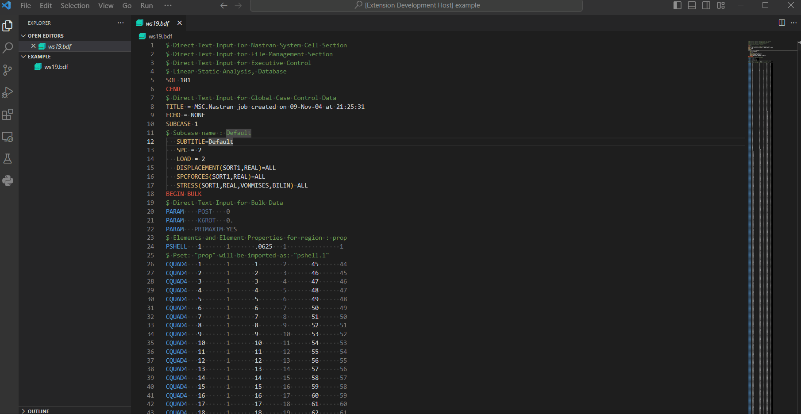
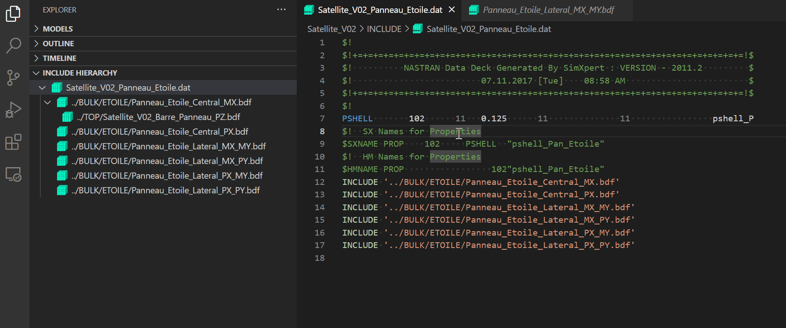
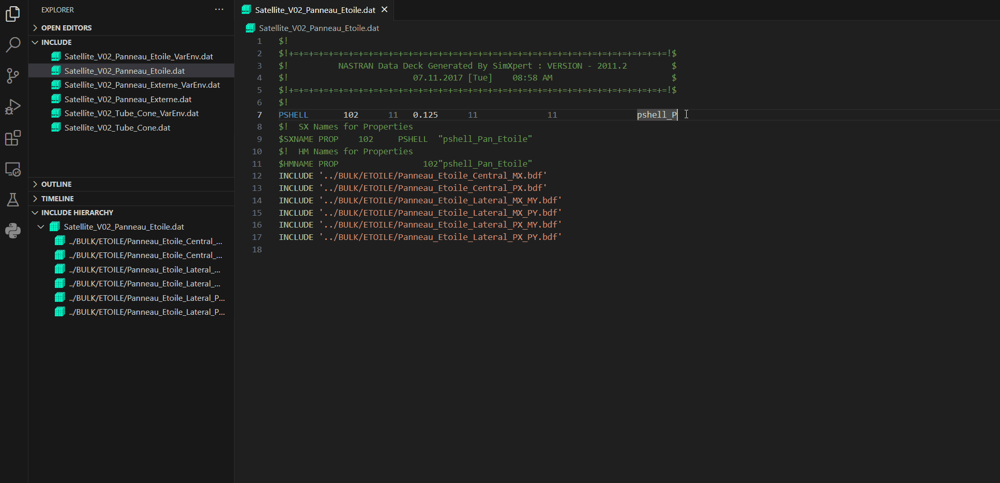
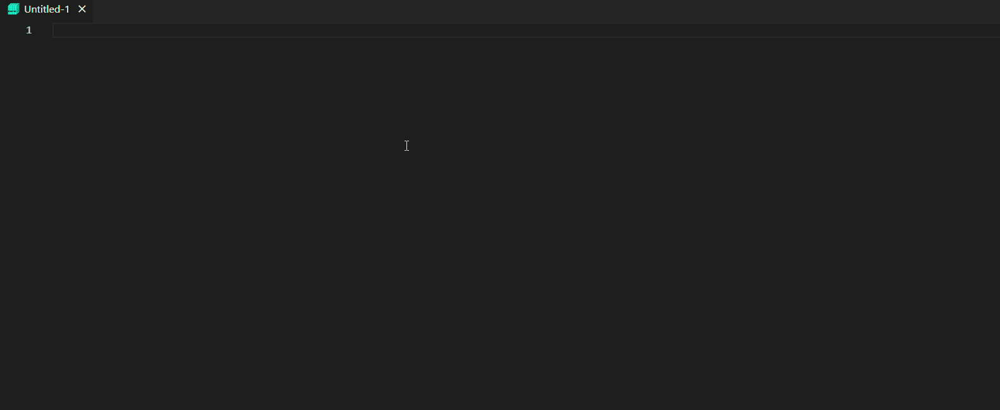

# Nastran Extension for Visual Studio Code

#### [Repository](https://github.com/dmarc3/vscode-nastran)&nbsp;&nbsp;|&nbsp;&nbsp;[Issues](https://github.com/dmarc3/vscode-nastran/issues)&nbsp;&nbsp;|&nbsp;&nbsp;[Changelog](https://github.com/dmarc3/vscode-nastran/blob/main/CHANGELOG.md)&nbsp;&nbsp;|&nbsp;&nbsp;[License](https://github.com/dmarc3/vscode-nastran/blob/main/LICENSE.md)&nbsp;&nbsp;|&nbsp;&nbsp;[Contribution Guidelines](https://github.com/dmarc3/vscode-nastran/blob/main/CONTRIBUTING.md)&nbsp;&nbsp;|&nbsp;&nbsp;[Code of Conduct](https://github.com/dmarc3/vscode-nastran/blob/main/CODE_OF_CONDUCT.md)

This [Visual Studio Code](https://code.visualstudio.com/) extension aims to build [`Nastran`](https://software.nasa.gov/software/LAR-16804-GS) "language" support with features akin to what software developers are accustomed to in their Integrated Development Environments (IDEs) while programming. `Nastran` stands for "**NA**SA **STR**uctural **AN**alysis" and is a finite element analysis software used to predict the behavior of a physical structure. While `Nastran` is not a programming language itself, `Nastran` models share many similarites to a programming language. These models are composed of text files built with a defined structure using keywords to identify model parameters and can be "compiled" and executed.

 The ultimate goal of this project is to provide a more efficient means of manipulating `Nastran` finite element models at the text file level through elimination of some of the key pain points and provide a more IDE-like experience.

> **Note**
> There are several flavors of `Nastran`. This extension is specifically built for [`MSC Nastran`](https://nexus.hexagon.com/documentationcenter/bundle/MSC_Nastran_2022.4/page/MSC_Nastran_main.htm); however, it may be expanded in the future to support [`Simcenter Nastran`](https://plm.sw.siemens.com/en-US/simcenter/mechanical-simulation/nastran/) and the original [`NASTRAN-95`](https://github.com/nasa/NASTRAN-95). There is significant overlap between the various versions of `Nastran` and this extension may still prove useful even if you are not using `MSC Nastran`.

## Requirements

In order to use this extension, the user must have the following installed:

- Python 3.7+
  - [`pygls`](https://github.com/openlawlibrary/pygls)

## Usage

Once the requirements are satisfied and the extension is installed through [Visual Studio Marketplace](https://marketplace.visualstudio.com/items?itemName=mbakke.vscode-nastran), the extension will automatically activate upon opening a `Nastran` file with the following [extensions](https://nexus.hexagon.com/documentationcenter/bundle/MSC_Nastran_2022.4/page/Nastran_Combined_Book/getstart/GS-Files/TOC.Types.of.MSC.Nastran.xhtml):

- `*.bdf`
- `*.dat`

If opening a `Nastran` file with a different extension, users may set the language by pressing `CTRL + K` followed by `M` and selecting `Nastran`. If you would like to permanently set the language for the given file extension, select the `Configure File Association for 'XXX'...` option.

## Features

Currently supported features include:

1. Syntax Highlighting
    - Color delineation between `Nastran` sections
        - File Management
        - Executive Control
        - Case Control
        - Bulk Data
    - Long and short format field highlighting

2. Documentation on keyword hover

    &nbsp;
    

3. Include file hierarchy tree view for easy navigation of model. Open top level `Nastran` run deck and run command (keybound to `F7`) to parse include paths and generate tree view. Command tied to "refresh" button on view.

    &nbsp;
    

4. "Find All" command (keybound to `ALT + F`) to search model for all substring occurrences and provide hyperlink to location in model.

    &nbsp;
    

5. `Nastran` execution command (keybound to `F6`)
    - `Nastran` [keyword arguments](https://nexus.hexagon.com/documentationcenter/bundle/MSC_Nastran_2022.4/page/Nastran_Combined_Book/qrg/nastran/TOC.Executing.MSC.Nastran1.xhtml) may be set via the `Nastran: Set execution keywords` command (accessed via `CTRL + SHIFT + P`)

6. Text completions with field names for rapid editing

    &nbsp;
    

7. Command to insert short and long field delineation comments

In addition to these features, the following are proposed features with no feasibility assessment or time table for implementation:

- `*.f06` and `*.f04` syntax highlighting
- Add documentation hover support for `DMAP` section
- Interactive plot view of 3D model highlighting currently selected element / grid  / etc.

If you have an idea for a feature, please create an issue and flag it as a `Feature Request`.

## Bug Reporting and Known Issues

Please create an issue as bugs are discovered. Provide specific details including screen shots or specific `Nastran` cards causing the bug.

- vscode does not support hover pane resizing. Depending on the resolution of the monitor, text may be wrapped to a new line and not be presented correctly. Users may find it helpful to reduce font size (`CTRL + -`) till hover text is no longer being wrapped or to minimize the explorer pane (`CTRL + B`).
- Extension was developed using vscode's `Dark (Visual Studio)` theme. The keyword sections where given colors based off of commonly defined [scopes](https://code.visualstudio.com/api/language-extensions/syntax-highlight-guide). All colors should update for the themes packaged with vscode but the chosen color may not be ideal or be distinguishable relative to adjacent colors. The following scopes are defined for each section / keywords:
  - Nastran Keyword: `string.regexp`
  - Section Dividers: `invalid`
  - File Management: `markup.inserted`
  - Executive Control: `string`
  - Case Control: `entity.name.tag.css`
  - Bulk Data: `constant.language`
  - Parameters: `constant.regexp`
