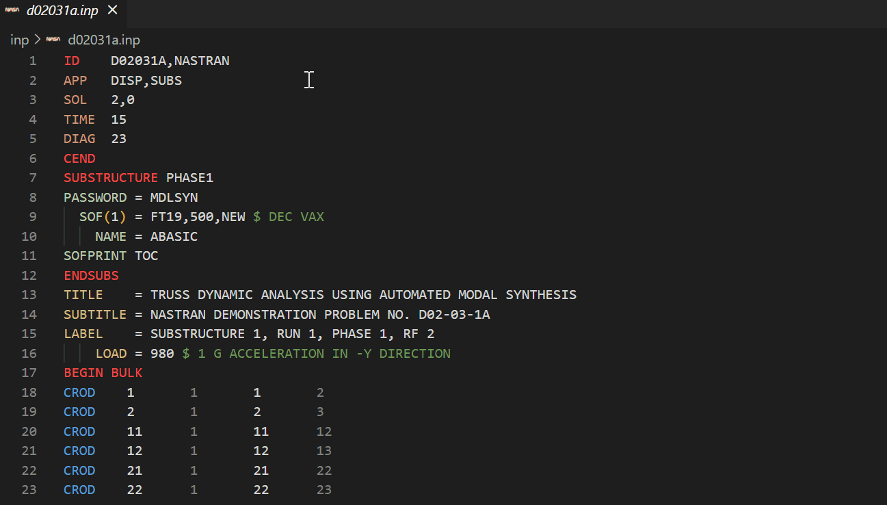
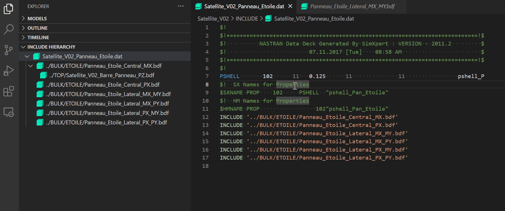

# Nastran Extension for Visual Studio Code

This [Visual Studio Code](https://code.visualstudio.com/) extension aims to build [`Nastran`](https://software.nasa.gov/software/LAR-16804-GS) "language" support with features akin to what software developers are accustomed to in their Integrated Development Environments (IDEs) while programming. `Nastran` stands for "**NA**SA **STR**uctural **AN**alysis" and is a finite element analysis software used to predict the behavior of a physical structure. While `Nastran` is not a programming language itself, `Nastran` models share many similarites to a programming language. These models are composed of text files built with a defined structure using keywords to identify model parameters.

 The ultimate goal of this project is to provide a more efficient means of manipulating `Nastran` finite element models at the text file level through eliminatation of some of the key pain points and provide a more IDE-like experience.

> **Note**
> There are several flavors of `Nastran`. This extension is specifically built for [`NASTRAN-95`](https://github.com/nasa/NASTRAN-95) - the open-source code which all commercially sold versions are based off of. The intention is to eventually support the two main commercial products, [`MSC Nastran`](https://hexagon.com/products/product-groups/computer-aided-engineering-software/msc-nastran) and [`Simcenter Nastran`](https://plm.sw.siemens.com/en-US/simcenter/mechanical-simulation/nastran/). While commercial versions of `Nastran` may have some differences in key words and file structure, there is significant overlap and this extension may still prove useful.

## Features

Currently supported features include:
1. Syntax Highlighting
    - Color delineation between `Nastran` sections
        - Executive Control Deck
        - Substructure Control Deck
        - Case Control Deck
        - Bulk Data Deck
        - Direct Matrix Abstraction Program
    - Long and short format field highlighting
2. Documentation on keyword hover

> **Note**
> Hover documentation is currently pulling from `NASTRAN-95` documentation only. Even with the version set to `MSC Nastran` documentation from `NASTRAN-95` will be displayed on hover.

&nbsp;

3. Include file hierarchy tree view for easy navigation of model. Open top level `Nastran` run deck and run command to parse include paths and generate tree view. Command tied to "refresh" button on view.

&nbsp;

4. Command to switch between `NASTRAN-95` and `MSC Nastran` syntax highlighting keywords. `Simcenter Nastran` syntax highlighting not yet developed.

&nbsp;

In addition to these features, the following are proposed features with no feasibility assessment or time table for implementation:
- Command to explictly set the `Nastran` section for highlighting. Models are sometimes compartmentalized into "include" files. Current logic searches the file for section breaks (i.e. `CEND`, `BEGIN BULK`, etc.) and colors accordingly. The user may want to be able to open a file which contains exclusively DMAP or Case Control cards.
- Expansion of documentation hovers to support `MSC Nastran` and `Simcenter Nastran` Quick Reference Guide documentation with hyperlinks.
- "Go to line" feature (i.e. Given a `CQUAD` which references 4 `GRID`s, jump to the definition of the specified `GRID`)
- Interactive plot view of 3D model highlighting currently selected element / grid  / etc.

If you have an idea for a feature, please create and issue and flag it as a `Feature Request`.

## Requirements
In order to use this extension, the user must have the following installed:
- Python 3.7+
    - [`pygls`](https://github.com/openlawlibrary/pygls)

## Usage
Once the requirements are satisfied and the extension is installed through [Visual Studio Marketplace](https://marketplace.visualstudio.com/items?itemName=mbakke.vscode-nastran), the extension will automatically activate upon opening a `Nastran` file with the following extensions:
- `*.bdf`
- `*.dat`
- `*.nas`
- `*.inp`

If opening a `Nastran` file with a different extension, users may set the language by pressing `CTRL` + `K` followed by `M` and selecting `Nastran`.

The language will default to version `NASTRAN-95` but will remember the last active version set.

## Known Issues

Please create an issue as bugs are discovered. Provide specific details including screen shots or specific `Nastran` cards causing the bug.

- VS Code does not support hover pane resizing. Depending on the resolution of the monitor, text may be wrapped to a new line and not be presented correctly. Users may find it helpful to reduce font size (`CTRL` + `-`) till hover text is no longer being wrapped.
- Extension was developed using VS Code's `Dark (Visual Studio)` theme. The keyword sections where given colors based off of commonly defined [scopes](https://code.visualstudio.com/api/language-extensions/syntax-highlight-guide). All colors should update for the themes packaged with VS Code but the chosen color may not be ideal or be distinguishable relative to adjacent colors.

## Release Notes

### v0.1.0

- Pre-release version of extension. Actively under development.

### v0.2.0

- Implementation of Include Hierarchy navigation pane
- Implementation of commands to switch between `NASTRAN-95` and `MSC Nastran`
- Creation of `MSC Nastran` syntax highlighting grammar
- Updated requirements to specifically callout need for Python>=3.7 with `pygls` installed
- Update to icons